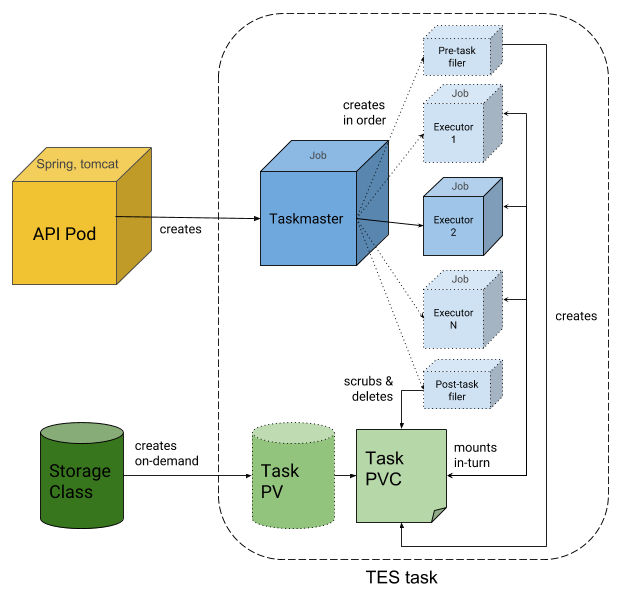

# Administrator guide

Welcome to the systems administrator guide to the [ELIXIR Cloud][elixir-cloud].
Whether you would like to onboard your data or compute center, set up your own
[GA4GH][ga4gh]-based cloud or simply play around with our compute and storage
solutions, this is the right place to get you off the ground.

## General deployment notes

Most of our services (see our [GitHub organization][elixir-cloud-aai-github]
for a comprehensive list) come with [Helm](https://helm.sh/) charts for
deployment on Cloud Native infrastructure and [Docker
Compose](https://docs.docker.com/compose/) configurations for
testing/development deployments. If you do not have experience with these
technologies, please find some brief primers with references to additional
documentation below.

### Using Helm

[Helm][helm] is an IaC tool that is described as the "package manager for
Kubernetes". It allows the management of the lifecycle of a Kubernetes
application, i.e., its deployment, configuration, upgrade, retiring, etc.
Applications ara packaged into "Charts".  Using Helm Charts allows us to
version control an application and therefore follow its evolution over time,
make identical copies (e.g., development, staging, production), make
predictable upgrades, and share/publish the application. 

Some useful Helm commands to manage a Chart are:

- `helm create`: Create a Helm Chart
- `helm install`: Install an application
- `helm upgrade`: Upgrade an application
- `helm uninstall`: Uninstall an application

### Using Docker Compose

Most of our services provide a [Docker Compose][docker-compose] configuration
file for easy deployment of the software on a local machine. If the [Docker
Engine][docker-engine] and [Docker Compose][docker-compose] are already
installed on your system, it is as simple as cloning the service's Git
repository, changing into the folder where the Docker Compose file resides
(typically `docker-compose.yml` in a repository's root directory) and running
the following:

```sh
docker-compose up -d
```

!!! note "Non-standard name or location of config file"
    The command will be different if the Docker Compose config file is _not_ in
    the current working directory and/or is _not_ called `docker-compose.yml`.

This will bring the service up. The argument `-d` (or `--detach`) starts the
app in daemonized mode, i.e., all launched containers that compose creates run
in the background.

In order to stop the deployment, simply run:

```sh
docker-compose down
```

## Onboarding your compute center

Follow the instructions below to onboard your compute node with the [ELIXIR
Cloud][elixir-cloud]. Afterwards, your compute cluster will be accessible
through the [GA4GH][ga4gh] Task Execution Service ([TES][ga4gh-tes]) API and,
optionally, available in the ELIXIR Cloud compute network.

### Deploying compute

Depending on whether you have a Native Cloud cluster or an HPC/HTC, you will
need to follow the instructions for deploying [TESK][tesk] or [Funnel][funnel]
below, respectively.

#### Deploying TESK

[TESK][tesk] uses the Kubernetes Batch API ([Jobs][k8s-jobs]) to schedule
execution of TES tasks. This means that it should be possible to deploy TESK in
any flavor of Kubernetes, but tests are currently only performed with
[Kubernetes][k8s], [OpenShift][openshift], and [Minikube][minikube]. Follow
these instructions if you wish to deploy a TES endpoint on your Native Cloud
cluster, and please let us know if you deploy TESK in any new and interensting
platform.

TESK currently does not use any other storage (DB) than Kubernetes itself.
[Persistent Volume Claims][k8s-pvc] are used as a temporary storage to handle
input and output files of a task and pass them over between executors of a
task. Note that PVCs are destroyed immediately after task completion! This
means your cluster will need to provide a ReadWriteMany
[StorageClass][k8s-storage-class]. Commonly used storage classes are
[NFS][nfs] and [CephFS][cephfs].

Here is an overview of TESK's architecture:

<div>
    <a href="https://github.com/elixir-cloud-aai/TESK">
        
    </a>
</div>

A [Helm][helm] chart is provided for the convenient deployment of TESK. The
chart is available in the [TESK code repository][tesk-helm].

Follow these steps:

1. [Install Helm][helm-install]
2. Clone the [TESK repository][tesk]:
   
    ```sh
    git clone https://github.com/elixir-cloud-aai/TESK.git
    ```
   
3. Find the Helm chart at `charts/tesk`
4. Edit file [`values.yaml`][tesk-helm-values] (see
   [notes](#notes-for-editing-chart-values) below)
5. Log into the cluster and install TESK with:
   
   ```sh
   helm install -n TESK-NAMESPACE TESK-DEPLOYMENT-NAME . \
     -f secrets.yaml \
     -f values.yaml
   ```
   
   * Replace `TESK-NAMESPACE` with the name of the namespace where you want to
   install TESK. If the namespace is not specified, the default namespace will
   be used.
   * The argument provided for `TESK-DEPLOYMENT-NAME` will be used by Helm to
   refer to the deployment, for example when upgrading or deleting the
   deployment. You can choose whichever name you like.

You should now have a working TESK isntance!

##### Notes for editing chart values

In the [TESK deployment documentation][tesk-docs-deploy] documentation there is
a [description of every value][tesk-docs-deploy-values]. Briefly, the most
important are:

1. `host_name`: Will be used to serve the API.
2. `storageClass`: Specify the storage class. If left empty, TESK will use the
   default one configred in the Kubernetes cluster.
3. `auth.mode`: Enable (`auth`) or disable (`noauth`; default) authentication.
   When enabled, an OIDC client **must** be in a file `./secrets.yaml`, with
   the following format:

   ```yaml
   auth:
       client_id: <client_id>
       client_secret: <client_secret>
   ```

4. `ftp`: Which FTP credentials mode to use. Two options are supported:
   `.classic_ftp_secret` for basic authentication (username and password) or
   `.netrc_secret` for using a [`.netrc`][netrc] file.
   
   For the classic approach, you must write in `values.yaml`:
   
   ```yaml
   ftp:
       classic_ftp_secret: ftp-secret
   ```
   
   And in a file `.secrets.yaml` write down the username and password as:
   
   ```yaml
   ftp:
       username: <username>
       password: <password>
   ```
   
   For the `.netrc` approach, create a `.netrc` file in the `ftp` folder with
   the connections details in the correct format.
   
5. `clusterType`: Type of Kubernetes flavor. Currently supported: `kubernetes`
   (default) and `openshift`.

!!! warning "Careful"
    When creating a `.secrets.yaml` file, ensure that the file is never shared
    or committed to a code repository!

##### Notes for deployment with microk8s

This section outlines how to install TESK via [microk8s][microk8s] as tested on
an Ubuntu 22.04 machine.

First, install microk8s through the Snap Store and add yourself to the
`microk8s` group::

```bash
sudo snap install microk8s --classic
sudo usermod -a -G microk8s $USER
```

Now let's create a directory for the microk8s configuration and enable Helm:

```bash
mkdir  ~/.kube
sudo chown -R $USER ~/.kube
microk8s enable helm3
```

Next, let's clone the TESK repository and move into it the Helm chart directory:

```bash
git clone https://github.com/elixir-cloud-aai/TESK.git
cd TESK/charts/tesk
```

Follow the deployment instructions to create `secrets.yaml` and modify
`values.yaml` as per your requirements.

> You **MUST** set `host_name`. To make the service available through the
> internet, see further below on how to configure the `service` section.

Great - you are now ready to deploy TESK!

First, let's create a namespace:

```bash
microk8s kubectl create namespace NAMESPACE
```

where `NAMESPACE` is an arbitrary name for your resource group.

Now let's use Helm to install:

```bash
microk8s helm3 install -n NAMESPACE RELEASE_NAME . -f secrets.yaml -f values.yaml
```

where `RELEASE_NAME` is an arbitrary name for this particular TESK release.

Congratulations - TESK should now be successfully deployed!

To find out the IP address at which TESK is available, run the following
command:

```bash
microk8s kubectl get svc -n NAMESPACE
```

The output could look something like this:

```console
NAME       TYPE        CLUSTER-IP        EXTERNAL-IP   PORT(S)    AGE
tesk-api   ClusterIP   123.123.123.123   <none>        8080/TCP   8s
```

Use the `CLUSTER-IP` and the `PORT` with the following template to construct the
URL at which the service is available (and make sure to replace the dummy URL
when you want to try out the calls below):

```console
http://CLUSTER-IP:PORT/ga4gh/tes/v1
```

So, in this example case, we get the following URL:

```console
http://123.123.123.123:8080/ga4gh/tes/v1
```

You can now test the intallation with the following example call to get a list
of tasks:

```bash
curl http://123.123.123.123:8080/ga4gh/tes/v1/tasks
```

If everything worked well, you should get an output like this:

```json
{
  "tasks": []
}
```

Let's try to send a small task to TESK:

```console
curl \
  -H "Accept: application/json"  \
  -H "Content-Type: application/json" \
  -X POST \
  --data '{"executors": [ { "command": [ "echo", "TESK says: Hello World" ], "image": "alpine" } ]}' \
  "http://123.123.123.123:8080/ga4gh/tes/v1/tasks"
```

That should give you a task ID:

```json
{
  "id" : "task-123ab456"
}
```

You can run the task list command from before again. Now the response should not
be an empty list anymore. Rather, you should see something like this:

```json
{
  "tasks" : [ {
    "id" : "task-123ab456",
    "state" : "COMPLETE"
  } ]
}
```

To get more details on your task, use the task ID from before in a call like
this:

```bash
curl http://123.123.123.123:8080/ga4gh/tes/v1/tasks/TASK_ID?view=FULL
```

We can use `jq` to parse the results. Let's say we want to see the logs of the
first (only, in this case) TES executor, we could do something like this:

```console
$curl -s http://123.123.123.123:8080/ga4gh/tes/v1/tasks/task-123ab456?view=FULL  | jq '.logs[0].logs'
```

Which would give us an output like this:

```json
[
  {
    "start_time": "2023-11-01T14:54:20.000Z",
    "end_time": "2023-11-01T14:54:25.000Z",
    "stdout": "TESK says: Hello World\n",
    "exit_code": 0
  }
]
```

Note that in the example, the API is only accessible internally. To make it
accessible publicly, we need to properly configure the `service` section in
`values.yaml`.

In particular, we would like to set the type to `NodePort` and then set an open
port on the host machine at which the API is exposed. For example, with

```yaml
service:
    type: NodePort
    node_port: 31567
```

Kubernetes will route requests coming in to port `31567` on the host machine to
port `8080` on the pod.

Let's confirm this by upgrading the Helm chart and again inspecting the services
in our namespace with:

```bash
microk8s helm3 upgrade -n NAMESPACE RELEASE_NAME . -f secrets.yaml -f values.yaml
microk8s kubectl get svc -n NAMESPACE
```

We should get an output like this:

```console
NAME       TYPE       CLUSTER-IP        EXTERNAL-IP   PORT(S)          AGE
tesk-api   NodePort   123.123.123.111   <none>        8080:31567/TCP   5s
```

Indeed, the port section changed as expected. Now, note that the `CLUSTER-IP`
_also_ changed. However, this is not a problem as Kubernetes will manage the
routing, so we don't really need to know the `CLUSTER-IP`. Instead, now we can
use the hostname (or IP) of the host machine, together with the port we set to
call our TES API from anywhere:

```
curl http://HOST_NAME_OR_IP:31567/ga4gh/tes/v1/tasks
```

> Of course you need to make sure that the port you selected is opened for
> public access. This will depend on your router/firewall settings.

If you would like to tear down the TESK service, simply run:

```bash
microk8s helm uninstall RELEASE_NAME -n NAMESPACE
```

#### Deploying Funnel

Follow these instructions if you wish to deploy a TES endpoint in front of your
HPC/HTC cluster (currently tested with [Slurm][slurm] and [OpenPBS][openpbs].

1. Make sure the build dependencies `make` and [Go 1.11+][go-install] are
   installed, `GOPATH` is set and `GOPATH/bin` is added to `PATH`.
   
   For example, in Ubuntu this can be achieved via:
   
   ```sh
   sudo apt update
   sudo apt install make golang-go
   export GOPATH=/your/desired/path
   export PATH=$GOPATH/bin:$PATH
   go version
   ```
   
2. Clone the repository:
   
   ```sh
   git clone https://github.com/ohsu-comp-bio/funnel.git
   ```
   
3. Build Funnel:

   ```sh
   cd funnel
   make
   ```
   
4. Test the installation by starting the Funnel server with:
   
   ```sh
   funnel server run
   ```

If all works, Funnel should be ready for deployment on your HPC/HTC.

##### Slurm

For the use of Funnel with Slurm, make sure the following conditions are met:

1. The `funnel` binary must be placed in a server with access to Slurm.
2. A config file must be created and placed on the same server. [This
   file][funnel-config-slurm] can be used as a starting point.
3. If we would like to deploy Funnel as a Systemd service,
   [this file][funnel-config-slurm-service] can be used as a template. Set the
   correct paths to the `funnel` binary and config file.

If successfull Funnel should be listening on port `8080`.

##### OpenPBS

!!! warning "Under construction"
    More info coming soon...

### Deploying storage

Follow the instructions below to connect your TES endpoint to one or more
ELIXIR Cloud cloud storage solutions. The currently supported solutions are:

- [MinIO][minio] (Amazon S3)
- [`vsftpd`][vsftpd] (FTP)

!!! note "Other storage solutions"
    Other S3 and FTP implementations may work but have not being tested.

#### Deploying MinIO (Amazon S3)

In order to deploy the [MinIO][minio] server, follow the [official
documentation][minio-docs-k8s]. It is very simple

If you are deploying Minio to OpenShift, you may find this
[Minio-OpenShift][minio-deploy-openshift-template] template useful.

#### Deploying `vsftpd` (FTP)

There are a lot of guides available online to deploy [`vsftpd`][vsftpd], for
example [this one][vsftpd-deploy]. There are only two considerations:

1. It is required to activate secure FTP support with `ssl_enable=YES`.
2. For onboarding with the ELIXIR Cloud, currently the server should have one
   account with a specific username and password created. Please [contact
   us][elixir-cloud-aai-email] for details.

### Registering your TES service

We are currently working on implementing access control mechanisms and
providing a user interface for the [ELIXIR Cloud
Registry][elixir-cloud-registry]. Once available, we will add registration
instructions here. For now, please let us know about your new TES endpoint by
[email][elixir-cloud-aai-email].
## Custom cloud deployments

!!! warning "Under construction"
    More info coming soon...
