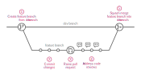

# General guidelines

For your contributions, please follow the guidelines laid out below to the best
of your ability.

??? note "Beginners"

    If you don't have a lot of experience with this sort of workflow, the
    guidelines in this section may seem overwhelming. But please don't worry!
    We will guide you through the process and you will soon get the hang of it.
    And please don't worry about making mistakes either - everybody does them.
    Often! Our project layout makes it very very hard for anyone to cause
    irreversible harm, so relax, try things out, take your time and enjoy the
    work! :)

## Communication

Please use the comment functions available on GitHub to discuss issues and
pull requests. For all other communications please refer to the communication
channels listed in the [contact](../../about/contact.md) section. In
particular, use the [chat][elixir-cloud-aai-slack] to discuss project ideas,
get help on a problem, or any other informal discussion that does not need to
be preserved as part of the repository you are working on.

## Submitting issues

Please use each project's GitHub issue tracker to:

- propose features
- report bugs
- find issues to work on
- discuss existing issues

As an example, you can find this project's issue tracker
[here][issue-tracker-example].

When submitting new issues to propose features or report bugs, please choose
the most appropriate template, if available, then follow the instructions in
the template.

You don't need to add labels or milestones for an issue, the project
maintainers will do that for you. However, it is important that all issues are
written concisely, yet with enough detail and relevant context (links,
screenshots, etc.) to allow others to start working on them. For bug reports,
it is essential that they include reproducible examples.

[Here][good-issues] and [here][good-bug-reports] are some resources to help you
get started on writing good issues.

## Branching model

All of our projects are version-controlled via [Git][git] and codebases are
hosted on [GitHub][github]. Please refer to appropriate documentation and
tutorials if you are not familiar with them.

To keep track our project histories clean, we follow a slightly modified
version of the [GitHub Flow][github-flow] Branching model. What this means is
that code changes are always merged into protected branches via pull requests
that will undergo one or more rounds of review and testing. The schema below
visualizes this process.

[][github-flow]

1. [Create a "feature branch"][git-branch] from the development branch; use the
   `feature/my-feature` naming pattern to name your feature branch, e.g.,
   `feature/update-docs`; make sure the development [branch
   is up to date][git-pull] before creating the feature branch!
2. [Commit code changes][git-commit] to address the issue you are working on
3. [Push the feature branch][git-push] to the remote and [create a pull
   request][github-pr] against the development branch in GitHub
4. Address any comments added during code review by pushing additional commits
   (there may be multiple rounds of reviews)
5. Once all issues are resolved, code owners will merge the feature branch into
   the development branch using the ["squash merging"][github-merge-squash]
   method

!!! note "Development branch"

    Typically, `dev` is the name of the development branch in our projects.
    In few cases (e.g., _this_ repository), there is no development branch
    and changes are merged immediately into the main branch, typically called
    `main`.

!!! note "Default branch"

    For project in pre-release state, i.e., those with version numbers below
    `v1.0.0`, the development branch is typically the default branch (meaning
    that the correct target branch for your PRs is set automatically).
    
    With the first major release, the default branch is set to the main
    branch instead. In that case, make sure to manually select the development
    branch as the target branch for your PRs.

??? note "Substantial changes"

    If your proposed changes will be substantial, try to split up the work into
    multiple feature branches. This makes reviewing easier, helps to keep the
    project history clean and may better guard against code regression. A rule
    of thumb is that you should be able to adequately summarize your changes
    with 50 characters.

    If your changes are becoming more substantial than you anticipated, you can
    request that the branch be ["rebase merged"][github-merge-rebase] instead
    of ["squash merged"][github-merge-squash]. However, we will only do so if
    you have exactly one clean commit for each semantic work package and each
    commit message follows the conventional commit specifications. You can use
    [`git rebase --interactive`][git-rebase] to clean up your feature branch.

??? warning "Feature branches unstable"

    All feature branches are to be considered unstable, i.e., their history may
    change at any time, even after being pushed to the remote. Therefore, do
    **not** work on feature branches without clearly communicating with the
    people who have created them.

## Commit messages

Generally, no specific formatting of individual commit messages is required when
working on _feature branches_. However, your **pull request titles MUST follow
the [Conventional Commits specification][conv-commits]**. The same is true for
individual commit messages if you are requesting that your feature branch be
"rebase merged" (see info box "Substantial changes" above).

[Conventional Commits][conv-commits] help to increase consistency, facilitate
maintenance and enable automated versioning and change log generation. Their
general structure is as follows:

```console
<type>(optional scope): <description>

[optional body]

[optional footer]
```

Please follow these rules for your commit messages / PR titles:

- Keep your entire header/title line (including type and, if available, scope)
  at **50 characters or less**
- Only use the types listed in the table below; choose the type according to the
  predominant reason for the change
- Only use types `feat`, `fix`, `perf`, `refactor` and `style` for changes in
  package/production code; use the dedicated types for all build-, CI-,
  documentation- or test-related changes
- Indicating a scope is optional; it is only necessary if scopes are generally
  used in the repository you are working on
- Start the `<description>` with a verb in imperative form (e.g., `add`, `fix`)
- If you include a body and/or footer, make sure it conforms to the
  Conventional Commits specification

Depending on the changes, we would kindly request you to use one of the
following **type** prefixes:

| Type | Description |
| --- | --- |
| build | For changes related to the build system (e.g., scripts, configurations and tools) and package dependencies |
| chore | For changes related to mundane repository maintenance tasks that are not covered by any of the other types (e.g., adding a `.gitignore file) | 
| ci | For changes related to the continuous integration and deployment system (e.g., workflows, scripts, configurations and tools) |
| docs | For changes related to the project documentation, regardless of the audience (end users, developers) |
| feat | For changes related to new abilities or functionality |
| fix | For changes related to bug fixes |
| perf | For changes related to performance improvements |
| refactor | For changes related to modifying the codebase, which neither adds a feature nor fixes a bug (e.g., removing redundant code, simplifying code, renaming variables) |
| revert | For changes that revert one or more previous commits |
| style | For changes related to styling the codebase (e.g., indentation, parentheses/brackets, white space, trailing commas) |
| test | For changes related to tests |

!!! info "Linting commit messages"

    In order to ensure that the format of your commit messages adheres to the
    Conventional Commits specification and the defined type vocabulary, you can
    use a [dedicated linter][conv-commits-lint]. More information can also be
    found in this [blog post][conv-commits-blog].

## Filing pull requests

Open pull requests through the GitHub interface, VS Code or your favorite Git
client. Make sure to follow the branching model. Most importantly:

??? warning "Use Conventional Commit messages for your PR titles!"

    See details in the [commit message](#commit-messages) section.

### Code reviews

All code changes are reviewed by at least one other person. This is to ensure
that the code is of high quality, that it is well-documented and that it adheres
to the project's coding standards. The reviewer will check that the code is
correct, that it is efficient and that it is maintainable. They will also check
that the code is well-documented and that it is tested.

Please make sure to actively request reviews for your pull requests to avoid
delays in the review and merging process. Please use the GitHub functionality
for that (upper right hand corner of pull request view). If you are unsure who
to ask for a review, please reach out to the project leads.

### Pull request template

The [pull request][pull_request] template will be successively added to all
repositories. Until that is the case, you can already make use of it by
self-reviewing your pull requests according to the checklist and descriptions.

[pull_request]: PULL_REQUEST_TEMPLATE.md
