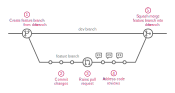

# Workflow

To start working with us, please follow these simple steps:

1. Join [:custom-github-black: GitHub][github-join].
2. Check out our [repositories][elixir-cloud-aai-github] and [open
   issues][elixir-cloud-aai-issues].
3. Join our [:custom-slack: Slack board][elixir-cloud-aai-slack].
4. Join the [`#oss-community`][elixir-cloud-aai-slack-channel-oss] and leave
   a short message about yourself. Please include (1) your relevant skills and
   experience level, (2) your GitHub username, (3) your email address (e.g.,
   for calendar invitations), and (4) the repositories or issues you are most
   interested in. If you can't decide, no problem, just indicate that you are
   open to work on anything and we will suggest some issues for you.
5. Once we have added you to our [GitHub
   organization][elixir-cloud-aai-github], you can assign yourself to an issue.
6. Please carefully read the [guidelines](#guidelines) below, as well as any
   relevant language-specific guidelines in this section.
7. Start coding! :computer:

!!! note "Privacy note"

    If you do not want to share your GitHub username and/or your email address
    in the public channel, please send a direct message to a
    [project lead][elixir-cloud-aai-contributors] instead.

!!! note "Always work on issues"

    If you want to propose code changes and there is no corresponding issue
    available, please make sure to open an issue first and get some feedback
    from project leads. This is to avoid the frustration of putting in work for
    nothing in case the project leads had other plans.

??? note "One-time contributors"

    If you like, you can skip steps 3. to 5. and raise pull requests from
    forks. Note, however, that some CI workflows may not (yet) be fully
    supported for pull requests raised from forks.

## Guidelines

For your contributions, please follow the guidelines laid out below to the best
of your ability.

??? note "Beginners"

    If you don't have a lot of experience with this sort of workflow, the
    guidelines in this section may seem overwhelming. But please don't worry!
    We will guide you through the process and you will soon get the hang of it.
    And please don't worry about making mistakes either - everybody does them.
    Often! Our project layout makes it very very hard for anyone to cause
    irreversible harm, so relax, try things out, take your time and enjoy the
    work! :)

### Communication

Please use the comment functions available on GitHub to discuss issues and
pull requests. For all other communications please refer to the communication
channels listed in the [contact](../../about/contact.md) section. In
particular, use the [chat][elixir-cloud-aai-slack] to discuss project ideas.

### Submitting issues

Please use each project's GitHub issue tracker to:

- propose features
- report bugs
- find issues to work on
- discuss existing issues

As an example, you can find this project's issue tracker
[here][issue-tracker-example].

When submitting new issues to propose features or report bugs, please choose
the most appropriate template, if available, then follow the instructions in
the template.

You don't need to add labels or milestones for an issue, the project
maintainers will do that for you. However, it is important that all issues are
written concisely, yet with enough detail and relevant context (links,
screenshots, etc.) to allow others to start working on them. For bug reports,
it is essential that they include reproducible examples.

[Here][good-issues] and [here][good-bug-reports] are some resources to help you
get started on writing good issues.

### Branching model

All of our projects are version-controlled via [Git][git] and codebases are
hosted on [GitHub][github]. Please refer to appropriate documentation and
tutorials if you are not familiar with them.

To keep track our project histories clean, we follow a slightly modified
version of the [GitHub Flow][github-flow] Branching model. What this means is
that code changes are always merged into protected branches via pull requests
that will undergo one or more rounds of review and testing. The schema below
visualizes this process.

[][github-flow]

1. [Create a "feature branch"][git-branch] from the `dev` branch; use the
   `feature/my-feature` naming pattern to name your feature branch, e.g.,
   `feature/update-docs`; make sure the `dev` [branch
   is up to date][git-pull] before creating the feature branch!
2. [Commit code changes][git-commit] to address the issue you are working on
3. [Push the feature branch][git-push] to the remote and [create a pull
   request][github-pr] in GitHub
4. Address any comments added during code review by pushing additional commits
   (there may be multiple rounds of reviews)
5. Once all issues are resolved, code owners will merge the feature branch into
   the `dev` branch using the ["squash merging"][github-merge-squash] method

!!! note "Default branch"

    `dev` is the default branch for all projects in pre-release state, i.e.,
    those with version numbers below `v1.0.0`. Upon release, `main` becomes
    the default branch, and [semantic versioning][sem-ver] is strictly adhered
    by.

??? note "Substantial changes"

    If your proposed changes will be substantial, try to split up the work into
    multiple feature branches. This makes reviewing easier, helps to keep the
    project history clean and may better guard against code regression. A rule
    of thumb is that you should be able to adequately summarize your changes
    with 50 characters.

    If your changes are becoming more substantial than you anticipated, you can
    request that the branch be ["rebase merged"][github-merge-rebase] instead
    of ["squash merged"][github-merge-squash]. However, we will only do so if
    you have exactly one clean commit for each semantic work package and each
    commit message follows the conventional commit specifications. You can use
    [`git rebease --interactive`][git-rebase] to clean up your feature branch.

??? warning "Feature branches unstable"

    All feature branches are to be considered unstable, i.e., their history may
    change at any time, even after being pushed to the remote. Therefore, do
    **not** work on feature branches without clearly communicating with the
    people who have created them.

### Commit messages

Generally, no specific formatting of individual commit messages is required when
working on _feature branches_. However, your **pull request titles MUST follow
the [Conventional Commits specification][conv-commits]**. The same is true for
individual commit messages if you are requesting that your feature branch be
"rebase merged" (see info box "Substantial changes" above).

[Conventional Commits][conv-commits] help to increase consistency, facilitate
maintenance and enable automated versioning and change log generation. Their
general structure is as follows:

```console
<type>(optional scope): <description>

[optional body]

[optional footer]
```

Please follow these rules for your commit messages / PR titles:

- Keep your entire header/title line (including type and, if available, scope)
  at **50 characters or less**
- Only use the types listed in the table below; choose the type according to the
  predominant reason for the change
- Only use types `feat`, `fix`, `perf`, `refactor` and `style` for changes in
  in package/production code; use the dedicated types for all build-, CI-,
  documentation- or test-related changes
- Indicating a scope is optional; it is only necessary if scopes are generally
  used in the repository you are working on
- Start the `<description>` with a verb in imperative form (e.g., `add`, `fix`)
- If you include a body and/or footer, make sure it conforms to the
  Conventional Commits specification

Depending on the changes, we would kindly request you to use one of the
following **type** prefixes:

| Type | Description |
| --- | --- |
| build | For changes related to the build system (e.g., scripts, configurations and tools) and package dependencies |
| chore | For changes related to mundane repository maintenance tasks that are not covered by any of the other types (e.g., adding a `.gitignore file) | 
| ci | For changes related to the continuous integration and deployment system (e.g., workflows, scripts, configurations and tools) |
| docs | For changes related to the project documentation, regardless of the audience (end users, developers) |
| feat | For changes related to new abilities or functionality |
| fix | For changes related to bug fixes |
| perf | For changes related to performance improvements |
| refactor | For changes related to modifying the codebase, which neither adds a feature nor fixes a bug (e.g., removing redundant code, simplifying code, renaming variables) |
| revert | For changes that revert one or more previous commits |
| style | For changes related to styling the codebase (e.g., indentation, parentheses/brackets, white space, trailing commas) |
| test | For changes related to tests |

!!! info "Linting commit messages"

    In order to ensure that the format of your commit messages adheres to the
    Conventional Commits specification and the defined type vocabulary, you can
    use a [dedicated linter][conv-commits-lint]. More information can also be
    found in this [blog post][conv-commits-blog].

### Filing pull requests

**Make sure to follow the [commit message](#commit-messages) rules for your pull
request titles.**

The following pull request template will be successively added to all
repositories. Until that is the case, you can already make use of it by
self-reviewing your pull requests according to the checklist and descriptions.

!!! note "All Contributors"

    The [All Contributors][all-contributors] bot may not be available in all
    repositories yet. In that case, please ignore the last bullet point.

#### Pull request template

##### Description

> Please include a summary of the change and the relevant issue(s) it resolves,
> if any (otherwise delete that line). If the PR addresses more than one issue,
> please add multiple lines, each starting with 'Fixes #'. In the summary, list
> any dependencies that are required for this change. Please use bullet points
> for the description. Please also include relevant motivation and context
> briefly if not already covered in the corresponding issue(s). For very
> trivial issues that are duly explained by the PR title, a description can be
> omitted (in that case, please delete the placeholder bullet point).

- 

Fixes #(issue number)

##### Checklist

> Please go through the following checklist to ensure that your change is ready
> for review. Please do not forget to double check the list after you have
> modified your PR, e.g., if you have added commits to address reviewer
> comments or to fix failing automated checks. Please check items also if they
> do not apply to your change, e.g., if your change does not require an update
> of the user-facing documentation, then still check the box. Generally, PRs
> are only reviewed when all boxes are ticked off and all automated checks pass
> (use the comment section below if you believe that your PR is ready to be
> merged even though not all boxes were ticked off).

- [ ] My code follows the [contributing guidelines](workflow.md) of this
      project, including, in particular, with regard to any style guidelines
- [ ] The title of my PR complies with the [Conventional Commits
      specification][conv-commits]; in particular, it clearly indicates
      that a change is a breaking change
- [ ] I acknowledge that all my commits will be squashed into a single commit,
      using the PR title as the commit message
- [ ] I have performed a self-review of my own code
- [ ] I have commented my code in hard-to-understand areas
- [ ] I have updated the user-facing documentation to describe any new or
      changed behavior
- [ ] I have added type annotations for all function/class/method interfaces
      or updated existing ones
- [ ] I have provided appropriate documentation (e.g., [Google-style
      Python docstrings][py-doc-google] or [JSDoc block tags][jsdoc]) for all
      functions/classes/methods or updated existing ones
- [ ] My changes generate no new warnings
- [ ] I have added tests that prove my fix is effective or that my feature
      works
- [ ] New and existing unit tests pass locally with my changes
- [ ] I have not reduced the existing code coverage
- [ ] I have asked the [@all-contributors bot][all-contributors-bot] to
      acknowledge my contributions by commenting on this PR with a request of
      the form `@all-contributors please add @YOUR_GH_HANDLE for TYPE_1,
      TYPE_2, ...`, where `TYPE_1` etc. refer to [contribution types supported
      by the All Contributors Specification][all-contributors-types] OR I do
      not want my contributions to be acknowledged by [All
      Contributors][all-contributors]

##### Comments

> If there are unchecked boxes in the list above, but you would still like your
> PR to be reviewed or considered for merging, please describe here why boxes
> were not checked. For example, if you are positive that your commits should
> _not_ be squased when merging, please explain why you think the PR warrants
> or requires multiple commits to be added to the history.
